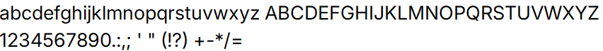
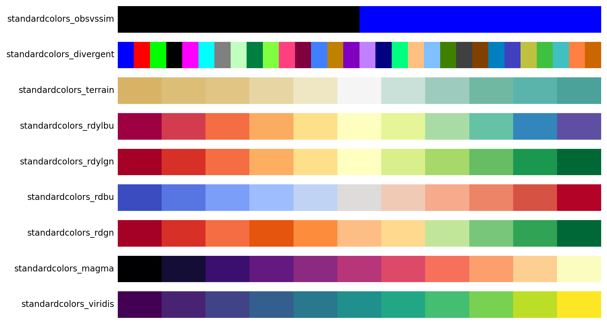
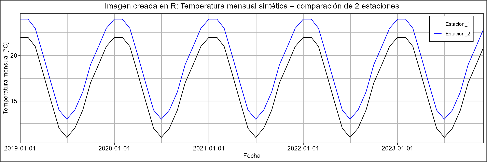
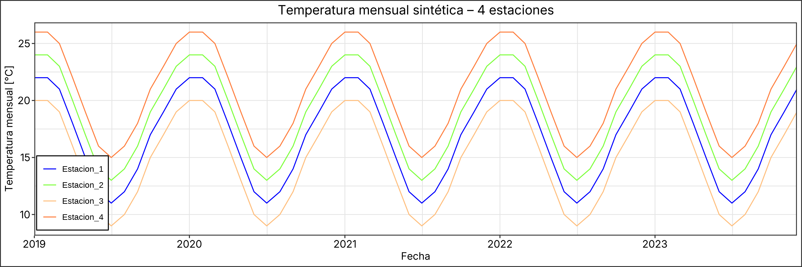

# Standard Visuals - Estándar mínimo de estilo

Este repositorio tiene como objetivo homogenizar las gráficas generadas en R (ggplot2) y Python (matplotlib), estandarizando tipos y tamaño de letras, estilos de grilla, colors de fondo, etc. El repositorio cuenta también con funciones para poder extraer paletas de colores, con el objetivo de trabajar con exactamente los mismos tonos en las gráficas.

## Estructura del Proyecto

```
standardvisuals/
├── style_tokens.json                     # Tokens mínimos de estilo
├── assets/
│   └── fonts/
│       └── Inter/                        # Fuente Inter (ver assets/fonts/Inter/README.md)
│           ├── Inter-Regular.ttf
│           └── Inter-SemiBold.ttf
├── pystandarvisuals/                     # Paquete Python
│   ├── pyproject.toml
│   └── src/pystandarvisuals/
│       └── create_theme_from_tokens.py
├── rstandarvisuals/                      # Paquete R
│   ├── DESCRIPTION
│   ├── NAMESPACE
│   └── R/create_theme_from_tokens.R
```

## Archivo de Tokens

`style_tokens.json` contiene la definición de atributos asociados a:

- **Tipografía**: título, subtítulo, títulos de ejes, texto de ejes y títulos de panel.
- **Bordes**: marco de figura y panel.
- **Grillas**: mayor y menor.

Un ejemplo simplificado de este archivo es:

```json
{
  "typography": {
    "title": { "family": "Inter", "size": 14, "color": "#000000" },
    "subtitle": { "family": "Inter", "size": 12, "color": "#000000" },
    "axis_title": { "family": "Inter", "size": 11, "color": "#000000" },
    "axis_text": { "family": "Inter", "size": 11, "color": "#000000" },
    "panel_title": { "family": "Inter", "size": 11, "color": "#000000" }
  },
  "borders": {
    "figure": { "color": "#333333", "linewidth": 0.9 },
    "panel": { "color": "#333333", "linewidth": 0.9 }
  },
  "grid": {
    "major": { "color": "#E5E5E5", "linewidth": 0.4 },
    "minor": { "color": "#E5E5E5", "linewidth": 0.4 }
  }
}
```

La fuente definida para los gráficos es Inter, cuya previsuzalización se presenta a continuación:




## Paletas de color (colors.json)

`colors.json` incluye paletas estándar para uso homogéneo en R y Python.

Paletas disponibles:
- `standardcolors_obsvssim` (2 colores): negro y azul
- `standardcolors_divergent` (30 colores): paleta multicolor diversa
- `standardcolors_terrain` (11 colores): tonos tierra desde marrón hasta verde azulado
- `standardcolors_rdylbu` (11 colores): paleta Spectral (Rojo-Amarillo-Azul divergente, igual a `sns.color_palette("Spectral")`)
- `standardcolors_rdylgn` (11 colores): rojo-amarillo-verde divergente
- `standardcolors_rdbu` (11 colores): paleta coolwarm (Rojo-Azul divergente, igual a `sns.color_palette("coolwarm")`)
- `standardcolors_rdgn` (11 colores): rojo-verde sin pasar por amarillo
- `standardcolors_magma` (11 colores): paleta magma (negro a amarillo mediante púrpura/rojo)
- `standardcolors_viridis` (11 colores): paleta viridis (púrpura a amarillo pasando por verde)

Para obtener fácilmente nombres y número de colores de cada paleta puedes llamar a `list_palettes()` después de instalar cualquiera de los paquetes; la salida muestra `name`, `n_colors` y `color_name`, y a partir de ahí puedes usar directamente los nombres de color devueltos por `get_palette()`.

Vista previa:



## Instalación desde GitHub

### Dependencias

**R**:

```r
install.packages(c("jsonlite", "ggplot2"))
```

**Python**:

```bash
pip install matplotlib pandas
```


## Uso en R (ggplot2)

### Instalar el paquete desde GitHub y estandarizar gráficas

```r
install.packages("remotes")
remotes::install_github("felipegateno/standardvisuals", subdir = "rstandarvisuals")

library(ggplot2)
library(dplyr)
library(tidyr)
library(rstandarvisuals)

# ============================================================
# 1) Generar serie mensual de temperatura (5 años)
#    - Estación 1: valores impuestos manualmente
#    - Estaciones 2–4: desplazamientos ±4 °C
# ============================================================

# Fechas mensuales (5 años)
fechas <- seq(
  as.Date("2019-01-01"),
  by = "month",
  length.out = 60
)

# Patrón mensual impuesto manualmente (°C)
temp_base <- c(
  22, 22, 21, 18, 15, 12,
  11, 12, 14, 17, 19, 21
)

# Repetir patrón 5 veces
temp_est_1 <- rep(temp_base, 5)

# DataFrame en formato ancho
data <- data.frame(
  date = fechas,
  Estacion_1 = temp_est_1,
  Estacion_2 = temp_est_1 + 2,   # +2 °C
  Estacion_3 = temp_est_1 - 2,   # −2 °C
  Estacion_4 = temp_est_1 + 4    # +4 °C
)

# ============================================================
# 2) Gráfico de 2 estaciones
#    usando standardcolors_obsvssim
# ============================================================

pal_obs_sim <- get_palette("standardcolors_obsvssim")

data_2 <- data %>%
  select(date, Estacion_1, Estacion_2) %>%
  pivot_longer(
    -date,
    names_to = "station",
    values_to = "temperature"
  )

p1 <- ggplot(data_2, aes(date, temperature, color = station)) +
  geom_line() +
  scale_color_manual(values = pal_obs_sim) +
  scale_x_date(breaks = "1 year",
               expand = c(0,0))+
  labs(
    title = "Temperatura mensual sintética – comparación de 2 estaciones",
    x = "Fecha",
    y = "Temperatura mensual [°C]"
  ) +
  create_theme_from_tokens()+
  # considerar que en python la leyenda se ajusta por defecto adentro
  # considerar tambien que en python por defecto la leyenda se enmarca en negro
  # debido a esto, es necesario ajustar algunos parámetros directo
  # desde el theme de ggplot  
  theme(legend.position = c(0.93, 0.88),
        legend.title = element_blank(),
        legend.background = element_rect(color = "black"))

print(p1)

# ============================================================
# 3) Gráfico de las 4 estaciones
#    usando standardcolors_divergent (n = 4)
# ============================================================

pal_div <- get_palette("standardcolors_divergent", n = 4)

data_4 <- data %>%
  pivot_longer(
    -date,
    names_to = "station",
    values_to = "temperature"
  )

p2 <- ggplot(data_4, aes(date, temperature, color = station)) +
  geom_line() +
  scale_color_manual(values = pal_div) +
  labs(
    title = "Temperatura mensual sintética – 4 estaciones",
    x = "Fecha",
    y = "Temperatura mensual [°C]"
  ) +
  scale_x_date(expand = c(0,0))+
  create_theme_from_tokens()+
  theme(legend.position = c(0.05, 0.2),
        legend.title = element_blank(),
        legend.background = element_rect(color = "black"))

print(p2)
```

## Uso en Python (matplotlib)

### Instalar el paquete desde GitHub y estandarizar gráficas

```bash
pip install git+https://github.com/felipegateno/standardvisuals.git#subdirectory=pystandarvisuals
```

```python
import numpy as np
import pandas as pd
import matplotlib.pyplot as plt
from pystandarvisuals import create_theme_from_tokens, get_palette

# ============================================================
# 1) Generar serie mensual de temperatura (5 años)
#    - Estación 1: valores impuestos manualmente
#    - Estaciones 2–4: desplazamientos ±4 °C
# ============================================================

# Fechas mensuales (5 años)
fechas = pd.date_range(start="2019-01-01", periods=60, freq="MS")

# Temperatura base mensual (estación 1)
# Patrón estacional impuesto manualmente (°C)
temp_base = np.array([
    22, 22, 21, 18, 15, 12,
    11, 12, 14, 17, 19, 21
])

# Repetir patrón 5 veces
temp_est_1 = np.tile(temp_base, 5)

# Construir DataFrame
data = pd.DataFrame({
    "date": fechas,
    "Estacion_1": temp_est_1,
    "Estacion_2": temp_est_1 + 2.0,   # +2 °C
    "Estacion_3": temp_est_1 - 2.0,   # −2 °C
    "Estacion_4": temp_est_1 + 4.0,   # +4 °C
})

# ============================================================
# 2) Gráfico de 2 series (observado vs simulado)
#    usando standardcolors_obsvssim
# ============================================================

colors_obs_sim = get_palette("standardcolors_obsvssim")

fig, ax = plt.subplots(figsize=(12, 4))

ax.plot(
    data["date"],
    data["Estacion_1"],
    color=colors_obs_sim["black"],
    label="Estacion_1",
)

ax.plot(
    data["date"],
    data["Estacion_2"],
    color=colors_obs_sim["pure_blue"],
    label="Estacion_2",
)

ax.set_title("Temperatura mensual sintética – comparación de 2 estaciones")
ax.set_xlabel("Fecha")
ax.set_ylabel("Temperatura mensual [°C]")
ax.legend()
# por defecto R aprovecha todo el ancho de la hoja, por lo que es necesario
# editar los margenes de python para tener mayor similitud
ax.margins(x=0)
ax.set_xlim(data["date"].min(), data["date"].max())

create_theme_from_tokens(ax)
plt.show()

# ============================================================
# 3) Gráfico de las 4 estaciones
#    usando standardcolors_divergent (n = 4)
# ============================================================

colors_div = get_palette("standardcolors_divergent", n=4)

fig, ax = plt.subplots(figsize=(12, 4))

for i, (color_name, color_hex) in enumerate(colors_div.items()):
    col = ["Estacion_1", "Estacion_2", "Estacion_3", "Estacion_4"][i]
    ax.plot(data["date"], data[col], color=color_hex, label=f"{col} ({color_name})")

ax.set_title("Temperatura mensual sintética – 4 estaciones")
ax.set_xlabel("Fecha")
ax.set_ylabel("Temperatura mensual [°C]")
ax.legend(ncol=2)
ax.margins(x=0)
ax.set_xlim(data["date"].min(), data["date"].max())

create_theme_from_tokens(ax)
plt.show()

```

> `get_palette()` retorna ahora un diccionario `name → hex` por defecto. Si necesitas los hex sin nombres, usa `dict_output=False` (por ejemplo `get_palette("standardcolors_obsvssim", dict_output=False)`). De paso, los nombres están disponibles tanto en R como en Python.

Si usas `subplots=True` en pandas:

```python
axes = df.plot(subplots=True, grid=True)
for ax in axes:
    create_theme_from_tokens(ax)
```

## Comparación R vs Python

### Gráfico 2 estaciones




### Gráfico 4 estaciones




